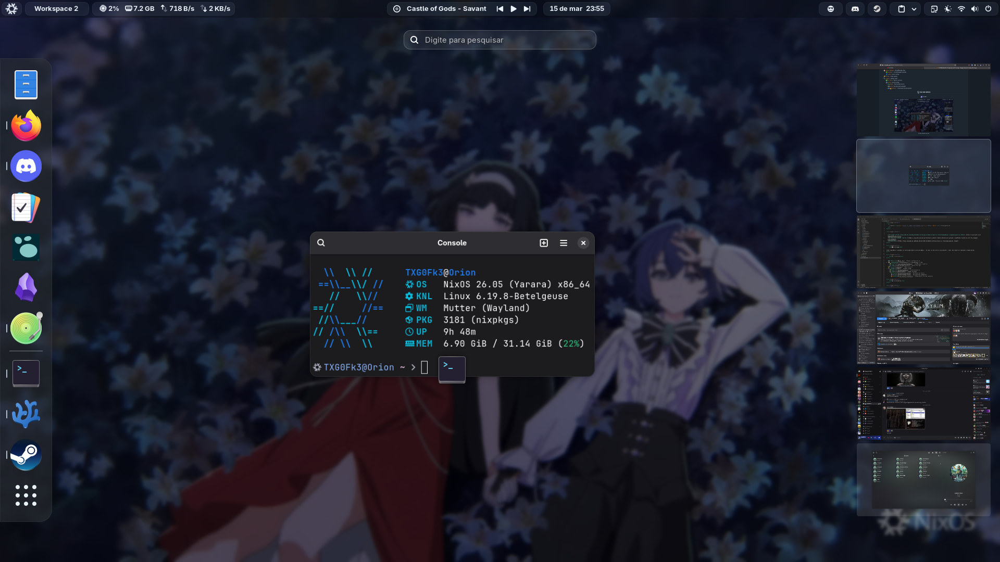

  <h1>
    TXG0Fk3's  Configuration
  </h1>

  
  
  
  

    <h2>📖 Overview</h2>

This repository contains my personal NixOS configuration. The goal is to have a consistent, fast, and easy-to-replicate environment.

    <h2>🗃️ Structure</h2>

- [❄️ flake.nix](flake.nix) - Flakes configuration
- [🏠 home-manager](home-manager/) - HomeManager files
  - [🧩 modules](home-manager/modules/) - HomeManager modules
  - [👤 users](home-manager/users/) - Users configs
- [🔑 secrets](secrets/) - Sops secrets
- [🔧 system](system/) - System Files
  - [🧩 modules](system/modules/) - System modules
  - [🖥️ hosts](system/hosts/) - Hosts configs
    - [🐉 hydra](system/hosts/hydra/) - My homelab server
    - [🌠 orion](system/hosts/orion/) - My personal computer
    - [🐦‍🔥 phoenix](system/hosts/phoenix) - Disposable virtual machine

    <h2>🖥️ Screenshots</h2>

  <h3>🌠 Orion</h3>
  
   
  GNOME • Marble-Blue-Dark

